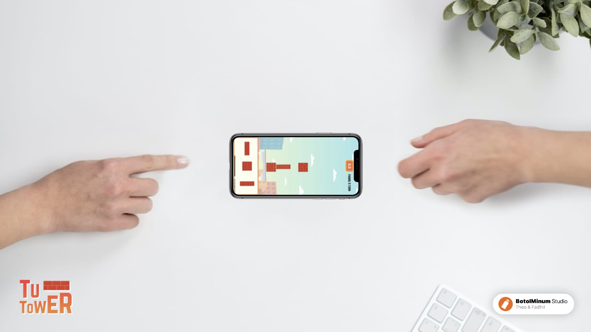

# TUTOWER game app
XCode project using SpriteKit for Nano Challenge 3 Apple Dev. Academy.
by BotolMinum Studio ([Theo](https://www.github.com/theofanisamuel) & [Fadhil](https://www.github.com/rahmanfadhil))

>TUTOWER is a casual game that trains young adults to work together by building towers alternately. In this game, each player needs to arrange the tower blocks in the right way to achieve a higher score.

 
 

